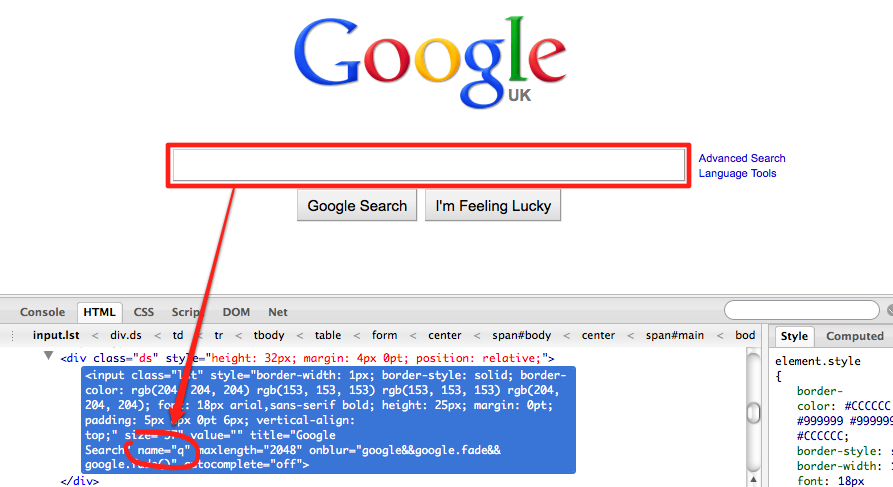
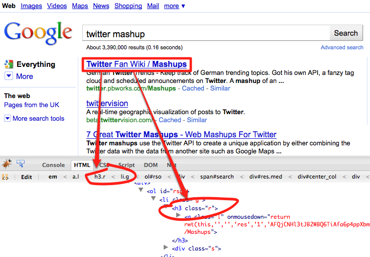
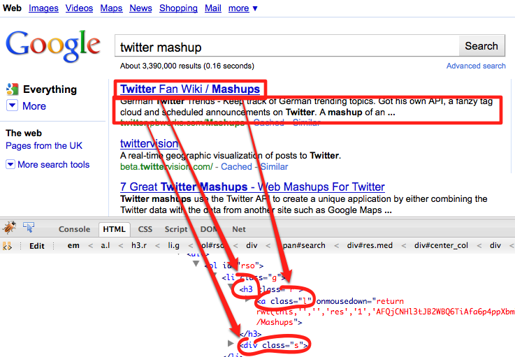

!SLIDE center
# Taking results from Google

!SLIDE
    require "scrubyt"

    @extractor = Scrubyt::Extractor.new do
      fetch "http://www.google.com/"
    end

!SLIDE full-page center

!SLIDE full-page center

!SLIDE
    require "scrubyt"

    @extractor = Scrubyt::Extractor.new do
      fetch "http://www.google.com/"
      fill_textfield "q", "twitter mashup"
      submit
    end

!SLIDE full-page center

!SLIDE
# From this:
    require "scrubyt"

    @extractor = Scrubyt::Extractor.new do
      fetch "http://www.google.com/"
      fill_textfield "q", "twitter mashup"
      submit
    end

!SLIDE
# To this:
    require "scrubyt"

    @extractor = Scrubyt::Extractor.new do
      fetch "http://www.google.com/"
      fill_textfield "q", "twitter mashup"
      submit
      mashup "//li[@class='g']//h3[@class='r']"
    end

!SLIDE
# You get:
    pp @extractor.results
    [{:mashup=>"Twitter Fan Wiki  / Mashups"},
     {:mashup=>"twittervision"},
     {:mashup=>"7 Great Twitter Mashups - Web Mashups For Twitter"},
     ...

!SLIDE full-page center

!SLIDE
      mashup "//li[@class='g']" do
        title "//h3[@class='r']"
        summary "//div[@class='s']"
        url "//h3[@class='r']/a", 
            :attribute => :href
      end

!SLIDE
# You get:

    [{:mashup=>
       [{:title=>"Twitter Fan Wiki  / Mashups"},
        {:summary=>
          "German Twitter Trends - ..."},
        {:url=>"http://twitter.pbworks.com/Mashups"}]},
     {:mashup=>
       [{:title=>"twittervision"},
        {:summary=>
          "A real-time geographic visualization ..."},
        {:url=>"http://beta.twittervision.com/"}]},
     ...