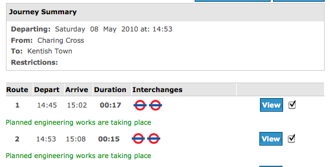

!SLIDE bullets incremental
# Transport For London

* Journey planning
* Current schedule information
* No documented API

!SLIDE full-page center

!SLIDE
# All we need to do is:

!SLIDE
# Go to the TFL website

    fetch "http://www.tfl.gov.uk/"
    
!SLIDE
# Fill in two text fields

    fill_textfield "name_origin", "charing cross"
    fill_textfield "name_destination", "kentish town"

!SLIDE
# Submit the form

    submit
    
!SLIDE
# Locate the the trip suggestions

    suggestion "//table" do
    end

!SLIDE full-page center
# Extract the info for each suggestion

!SLIDE
# Extract the info for each suggestion

    suggestion "//table" do
      departs "//td[@class='depart']", 
              :required => true
      arrives "//td[@class='arrive']", 
              :required => true
      duration "//td[@class='duration']", 
               :required => true
    end

!SLIDE full-page center

!SLIDE
# Navigate to a sub-page and repeat...

    trip_detail "//td[6]//a" do
      step "//table[@class='routedetails']//tr/td[2]/a"
    end

!SLIDE
# We end up with

    require "scrubyt"

    @extractor = Scrubyt::Extractor.new do
      fetch "http://www.tfl.gov.uk/"
      fill_textfield "name_origin", "charing cross"
      fill_textfield "name_destination", "kentish town"
      submit
      suggestion "//table" do
        departs "//td[@class='depart']", :required => true
        arrives "//td[@class='arrive']", :required => true
        duration "//td[@class='duration']", :required => true
        trip_detail "//td[6]//a" do
          step "//table[@class='routedetails']//tr/td[2]/a"
        end
      end
    end

!SLIDE
# And it gives us:
    [{:suggestion=>
       [{:departs=>"14:57"},
        {:arrives=>"15:14"},
        {:duration=>"00:17"},
        {:trip=>
          [{:step=>"Charing Cross Underground Station"},
           {:step=>"Camden Town Underground Station"},
           {:step=>"Kentish Town Underground Station"}]}]},
     ...